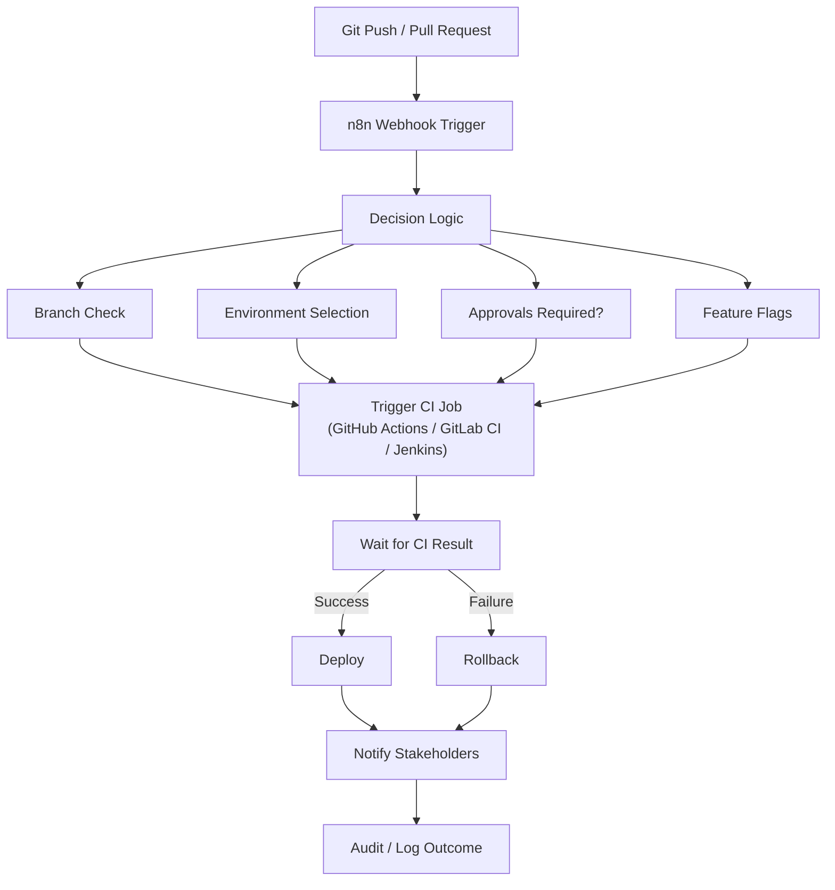

## Rough workflow



## Security

using `X-Hub-Signature-256`
```
const crypto = require('crypto');

const secret = $env.N8N_WEBHOOK_SECRET;
const signature = $headers['x-hub-signature-256'];
const rawBody = $json; // see note below

const hmac = crypto
  .createHmac('sha256', secret)
  .update(JSON.stringify(rawBody))
  .digest('hex');

const expected = `sha256=${hmac}`;

if (signature !== expected) {
  throw new Error('Invalid GitHub signature');
}

return items;
```

## Why?

Anything this repo does can be achieved by just setting up GitHub workflows or GitHub Actions. So why go through the trouble of using n8n? Furthermore isn't n8n known to be unreliable and non-deterministic due to the extensive use of LLM?

- good learning experience 🤓

## Non Goals

compiling code, running tests, building images, CI/CD being LLM powered

## Goals

high level pipeline control
- triggering jobs
- coordinating jobs
- making decisions (without the use of LLM!)
- delegating build/test/deploy execution (shell, docker, github actions/workflows)

big benefit of n8n is having a good visual high level overview and being able to adjust the flows quickly.

## How?

This repository will utilize the WAT framework.
See gsnake-n8n/CLAUDE.md to get a better understanding

### Requirements

n8n:
- claude: n8n-mcp-skills
- n8n mcp server
- running n8n instance

notification (and/or):
- telegram
- whatsapp
- discord

secrets:
- N8N_WEBHOOK_SECRET for GitHub -> n8n webhook communication (see security)
- GITHUB_TOKEN for n8n -> GitHub Workflow Dispatch communication

## Credits

Credit to the WAT Framework idea goes to [Nate Herk](https://www.youtube.com/watch?v=saggDHHnmtQ)
Slightly altered to fit my needs.