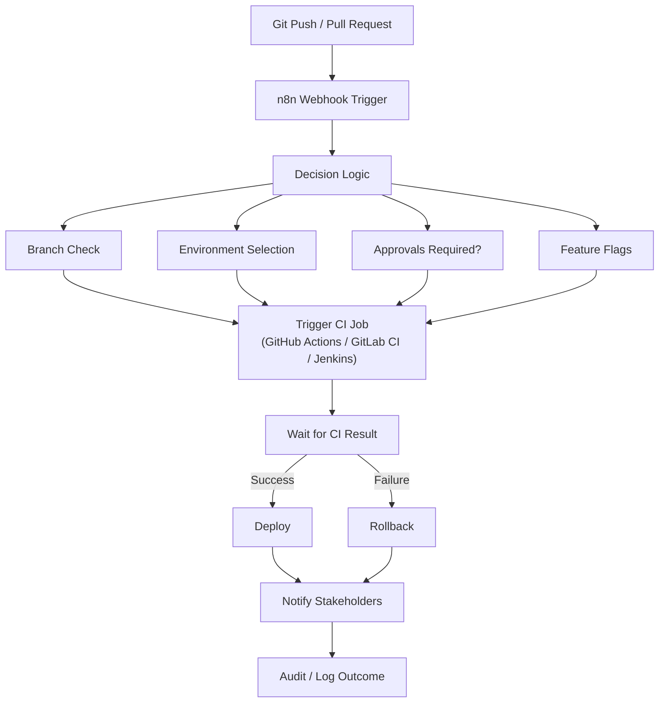

## Rough workflow


```mermaid
flowchart TD
    A[Git Push / Pull Request] --> B[n8n Webhook Trigger]

    B --> C[Decision Logic]
    C --> C1[Branch Check]
    C --> C2[Environment Selection]
    C --> C3[Approvals Required?]
    C --> C4[Feature Flags]

    C1 --> D[Trigger CI Job]
    C2 --> D
    C3 --> D
    C4 --> D

    D["Trigger CI Job<br/>(GitHub Actions / GitLab CI / Jenkins)"] --> E[Wait for CI Result]

    E -->|Success| F[Deploy]
    E -->|Failure| G[Rollback]

    F --> H[Notify Stakeholders]
    G --> H

    H --> I[Audit / Log Outcome]
```

## Security

using `X-Hub-Signature-256`
```
const crypto = require('crypto');

const secret = $vars.N8N_WEBHOOK_SECRET; // n8n workflow variable
const signature = $headers['x-hub-signature-256'];
const rawBody = $json; // see note below

const hmac = crypto
  .createHmac('sha256', secret)
  .update(JSON.stringify(rawBody))
  .digest('hex');

const expected = `sha256=${hmac}`;

if (signature !== expected) {
  throw new Error('Invalid GitHub signature');
}

return items;
```

## Why?

Anything this repo does can be achieved by just setting up GitHub workflows or GitHub Actions. So why go through the trouble of using n8n? Furthermore isn't n8n known to be unreliable and non-deterministic due to the extensive use of LLM?

- good learning experience 🤓

## Non Goals

compiling code, running tests, building images, CI/CD being LLM powered

## Goals

high level pipeline control
- triggering jobs
- coordinating jobs
- making decisions (without the use of LLM!)
- delegating build/test/deploy execution (shell, docker, github actions/workflows)

big benefit of n8n is having a good visual high level overview and being able to adjust the flows quickly.

## How?

This repository will utilize the WAT framework.
See gsnake-n8n/CLAUDE.md to get a better understanding

### Requirements

n8n:
- claude: n8n-mcp-skills
- n8n mcp server
- running n8n instance

notification (and/or):
- telegram
- whatsapp
- discord

secrets:
- `N8N_WEBHOOK_SECRET` workflow variable for GitHub -> n8n webhook signature validation
- `discordWebhookApi` credential for n8n -> Discord webhook delivery
- `githubApi` credential for n8n -> GitHub Workflow Dispatch communication

## Ralph Bridge (host service)

`tools/scripts/ralph-bridge.js` runs on the host and acts as an HTTP bridge between n8n and the AI CLI tools (`claude`, `codex`). n8n cannot invoke host binaries directly, so the bridge exposes a small REST API that n8n calls via `host-gateway`.

### First-time setup

1. Copy the example env file and fill in your values:
   ```bash
   cp tools/scripts/ralph-bridge.env.example tools/scripts/ralph-bridge.env
   # edit RALPH_WEBHOOK_TOKEN to match the value in the n8n .env
   ```

2. Install and start the systemd service:
   ```bash
   sudo cp tools/scripts/ralph-bridge.service /etc/systemd/system/
   sudo systemctl daemon-reload
   sudo systemctl enable --now ralph-bridge
   ```

3. Verify it is running:
   ```bash
   sudo systemctl status ralph-bridge
   curl http://localhost:8765/status
   ```

### Managing the service

```bash
sudo systemctl start ralph-bridge
sudo systemctl stop ralph-bridge
sudo systemctl restart ralph-bridge
sudo systemctl status ralph-bridge
```

### Logs

```bash
# Latest entries
journalctl -u ralph-bridge -n 50

# Follow live
journalctl -u ralph-bridge -f

# Since last boot
journalctl -u ralph-bridge -b

# Last hour
journalctl -u ralph-bridge --since "1 hour ago"
```

### Updating after code changes

The service reads `ralph-bridge.js` directly from the repo — no reinstall needed. A restart picks up any changes:

```bash
sudo systemctl restart ralph-bridge
```

If you change `ralph-bridge.service` itself, redeploy it first:

```bash
sudo cp tools/scripts/ralph-bridge.service /etc/systemd/system/
sudo systemctl daemon-reload
sudo systemctl restart ralph-bridge
```

### Environment file

`tools/scripts/ralph-bridge.env` is gitignored. The example at `tools/scripts/ralph-bridge.env.example` documents all variables. Key ones:

| Variable | Description |
|---|---|
| `RALPH_BRIDGE_PORT` | Port the bridge listens on (default `8765`) |
| `RALPH_REPO_PATH` | Absolute path to the gSnake repo root |
| `RALPH_N8N_PATH` | Absolute path to the `gsnake-n8n` submodule |
| `RALPH_WEBHOOK_TOKEN` | Bearer token — must match `RALPH_WEBHOOK_TOKEN` in the n8n `.env` |
| `RALPH_ITERATION_TIMEOUT` | Seconds before a running CLI is killed (default `18000`) |

## Credits

Credit to the WAT Framework idea goes to [Nate Herk](https://www.youtube.com/watch?v=saggDHHnmtQ)
Slightly altered to fit my needs.
